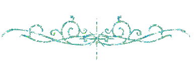

<html>

&#10036; i love you 2 the max &#10036;

           
  
<a href="artfolder/art.html" 
  style="color: white;
  background-color: purple;
  font-family:luminari;
            font-size:25px;">&#x2192;  CLICK HERE  &#x2190;</a>

 <h3><a href="aboutmefolder/me.html"
                  style="color: crimson;"
          text-align="center">about me</a></h3>

  
      
<body background="images/bgbgbg.png">
<form>
          <body style="font-family:luminari;
                       font-size:20px;">
  <form action=" https://github.com/prettygirlmilkingacow/prettygirlmilkingacow.github.io/blob/da26b5efc77362a95434a119995f69d46ee9c50e/action_page.php  ">
   
            <label for="dreams"
                   style="font-family:luminari;
                          font-size:20px;">what have you been dreaming about</label> 
  <input type="text" id="dreams" name="dreams" value=""> 
  <input type="submit" value="send"
         style="background-color:purple;
                color:white;">

</form> 
  

             

                        

